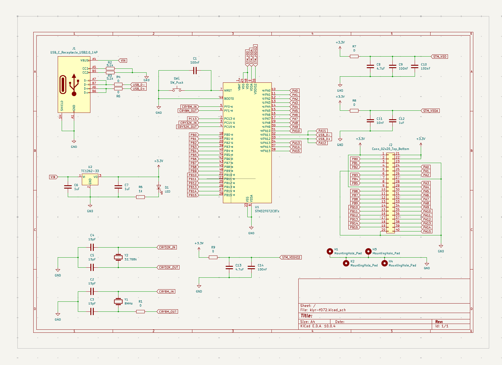
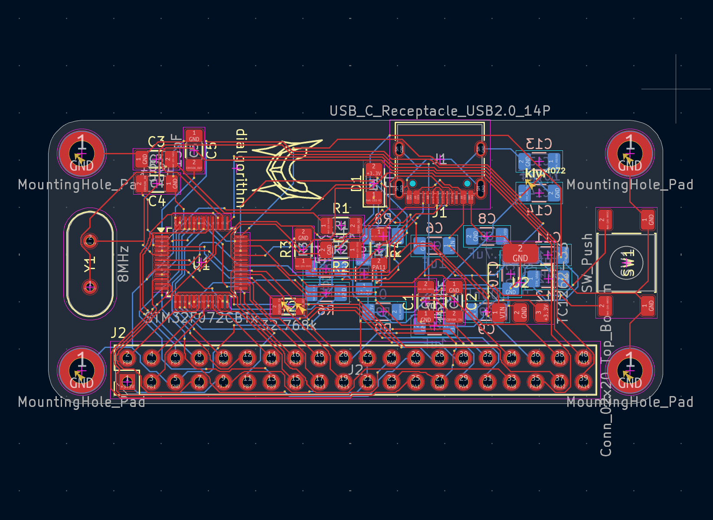
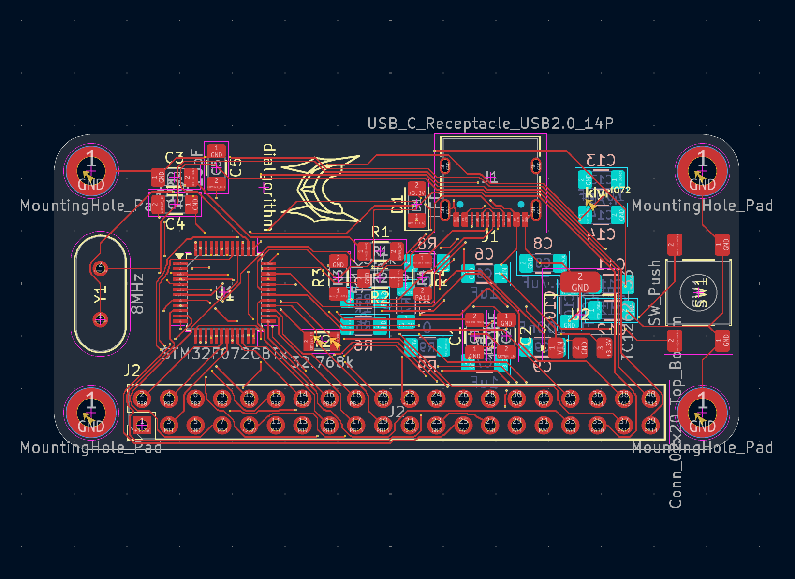
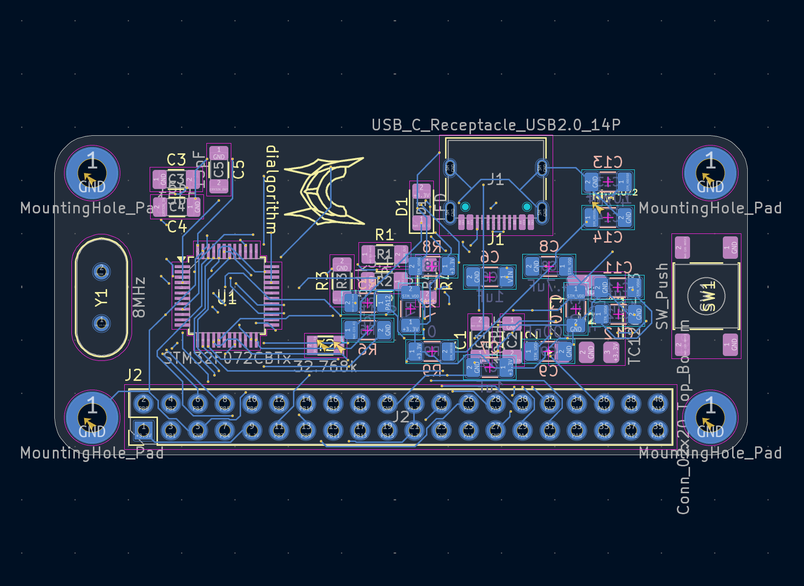

<h1 align="center">
  klyr f072
   
</h1>

<h4 align="center">
    STM32F072CBT6 dev board with usb c
</h4>

## Schematics + PCB

| Schematic | PCB |
|  |  |

| top layer | bottom layer |
|  |  |

## BOM

the complete bill of materials is available in [`bom.csv`](bom.csv).
